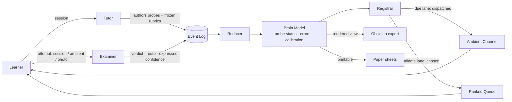

# Anamnesis — Project Charter

> **One-line pitch:** A local-first learning system that maintains an evidence-backed model of what you know, teaches Socratically to fill the gaps, and asks you questions between sessions so nothing decays unnoticed.

*Name is `proposed` — anamnesis is both Plato's "learning as recollection" and the clinical term for a patient history. Rename freely; the slug propagates.*

---

## Table of Contents

1. [TL;DR](#1-tldr) · 2. [Problem](#2-problem--motivation) · 3. [Users](#3-users--use-cases) · 4. [Solution Concept](#4-solution-concept) · 5. [Scope & Constraints](#5-scope-non-goals--constraints) · 6. [Objectives](#6-objectives--success-criteria) · 7. [Requirements](#7-functional-requirements) · 8. [NFRs](#8-non-functional-requirements) · 9. [Technical Direction](#9-technical-direction) · 10. [Risks](#10-risks--challenges) · 11. [Assumptions & Open Questions](#11-assumptions--open-questions) · 12. [Decision Log](#12-decision-log) · 13. [Glossary](#13-glossary) · 14. [Optional modules](#14-optional-modules) · 15. [Handoff](#15-handoff--design-spec) · 16. [Changelog](#16-changelog)

---

## 1. TL;DR
`[CORE]` · status: `draft`

Anamnesis is a single-user desktop application that models a learner rather than a corpus. Where Anki tracks when you last saw a card and Obsidian tracks what you wrote, Anamnesis tracks **whether you can produce an answer unaided, by what route, and how confident you were while getting it wrong** — and derives everything else from that record.

It is built for one person: a self-directed learner working through technical material alone, with no teacher to notice that they keep failing the same way. It replaces a hand-built system (Claude Project + Obsidian vault + Anki) that produced real learning but failed structurally — rules written as prose in a skill file are advisory, so due items rotted for twelve days and confidence ratings got argued upward under user pushback.

The approach: three components that cannot see each other's context. A **tutor** teaches Socratically and authors probes with frozen rubrics. An **examiner** grades attempts blind — no conversation history, no rapport, no pushback to yield to. A **registrar** owns the queue and dispatches decayed items to an ambient channel, so learning continues between sessions. All three emit events; status is computed from the log and can never be written directly.

Done for v1 means: the examiner grades reliably enough that the confidence map is trustworthy without re-verification, nothing past its review date goes unnoticed, and the majority of retrieval happens without opening the app.

---

## 2. Problem & Motivation
`[CORE]` · status: `agreed`

- **Problem:** Every learning tool models the material; none models the learner. Anki knows the schedule but not whether you understand the mechanism. Obsidian knows what you typed but not whether you could reproduce it. NotebookLM knows your documents but will explain the same concept forty times without noticing you break in the same place each time. The consequence is that nothing can tell you what to revise, nothing notices a recurring error, and any confidence you have in your own coverage is self-reported guesswork.

- **Gap:** Three specific absences. (i) No tool records *evidence* behind a confidence rating — re-reading and cold recall are stored identically or not at all. (ii) No tool records *how* you fail, only that you did; a right answer reached by wrong reasoning is indistinguishable from understanding. (iii) No tool can reach you between sessions, so the schedule only runs when you remember to open the app — which is precisely when you least need reminding.

- **Why now:** A working prototype of this already exists as a Claude Project writing to Obsidian and Anki, and it has been run for weeks against real material. It produced things no generic tutor could — including a cross-session diagnosis of the author's own failure mode ("in physics a wrong route produces a wrong number and gets caught; in biology it produces a right-sounding sentence and sails through"). It also failed in ways that are structural rather than incidental, and those failures are the specification: prose rules aren't enforced, an LLM writing its own state produces drift, and a grader holding conversational context yields to pressure.

- **Cost of doing nothing:** The prototype keeps working unreliably. Its confidence labels can't be trusted without independently re-deriving them, which costs more time than having no map at all — and a false confidence map is worse than a gap, because you stop looking.

---

## 3. Users & Use Cases
`[CORE]` · status: `agreed`

**Primary user:** the author — a self-directed learner studying technical material solo, across multiple unrelated domains, over years. **v1 has exactly one user.** This licenses very large simplifications: no accounts, no tenancy, no onboarding, no sync, no permissions.

| ID | Use case | Actor | Job-to-be-done | Trigger |
|---|---|---|---|---|
| UC-1 | Learn a new topic | Learner | Understand new material well enough to reproduce it unaided | Opens a session, names the topic and source |
| UC-2 | Get asked, unprompted | System → Learner | Re-test something decaying, without the learner initiating | Registrar finds a due probe within the daily budget |
| UC-3 | Decide what's next | Learner | Choose what to deepen, from a ranked list of what the system thinks is weak | Opens the app with no fixed plan |
| UC-4 | Audit my own knowledge | Learner | See what is genuinely known, how they fail, where they're overconfident | Before an assessment, or on a whim |
| UC-5 | Practise on paper | Learner | Produce answers by hand under exam-like conditions and have them graded | Topic closes, or a desk-class probe comes due |

**Explicit non-users:** classrooms and cohorts; teams; learners who want a curriculum authored *for* them; anyone seeking passive content consumption. Anamnesis requires the learner to supply the material and do the retrieval — it is not a content product.

---

## 4. Solution Concept
`[CORE]` · status: `agreed`

**In one line:** A learning system that maintains a model of the learner — built only from graded retrieval attempts — and uses that model to teach, to schedule, and to interrupt.

**How it works, conceptually.** The atomic unit is the **probe**: a specific retrieval prompt bound to a concept, carrying a frozen rubric. A concept is not a thing you set a confidence on; it is a **rollup of its probes**, so "Properties of Water" is not `solid (3)` but *explain-back at 0.94, transfer at 0.61* — which is a far more honest map and catches the failure mode a single number hides.

Three components handle probes, deliberately starved of each other's context. The **tutor** teaches, and at end-of-topic authors probes and rubrics while the error trail is still live. The **examiner** grades an attempt seeing only the concept, the prompt, the verbatim response, the rubric, and a flag for whether the answer was already on screen — it never sees the conversation, so it has no rapport to protect and no pushback to absorb. The **registrar** reads the store, never the conversation, and decides what happens today.

Nothing writes state. Every component emits **events**; a deterministic reducer computes status, confidence, and scheduling. Status therefore has no field to overwrite and cannot be argued upward. Notes and the knowledge graph are **rendered views** over the log, exported to Obsidian — so they cannot drift from the truth, because they *are* the truth, formatted.

Retrieval runs in two lanes that must never merge. **Due** items are dispatched, not chosen, and arrive ambiently — a one-line question on the learner's phone, out of context, days later, which is the purest unaided retrieval the system can obtain. **Candidates** are exploration: the system identifies what deserves probing and presents it ranked; the learner chooses.



---

## 5. Scope, Non-Goals & Constraints
`[CORE]` · status: `agreed`

**In scope (v1):** session tutoring with material-type diagnosis; probe and rubric authoring at topic close; blind grading; the event log and derived state; per-probe memory scheduling; the two-lane queue with candidate generation and ranking; ambient dispatch and reply-grading on one channel; Obsidian export; printable paper export.

**Out of scope / non-goals:**

- **No multi-user, accounts, sync or cloud storage** — one local operator. Revisit only after v1 is proven for one person.
- **No corpus RAG or document Q&A** — this is explicitly not NotebookLM. Sources are parsed for *structure* (topic tree, weights, dependencies) and never retrieved from during teaching, because a tutor that can look up the answer stops being able to tell whether you knew it.
- **No content library or pre-authored curricula** — the learner supplies the material. Shipping curricula is a content business, not this one.
- **No mobile app** — the ambient messaging channel *is* the mobile surface. Building a second client would duplicate it for no gain.
- **No bulk review grinding in-app** — this is not a flashcard trainer. Rote reps belong in Anki (see Q-5); the app runs targeted probes only.
- **No note authored from anything but retrieval** — nothing enters the brain model that wasn't earned. A note that looks like knowledge and isn't is the failure the system exists to prevent.
- **No fine-tuned or specialised models in v1** — frontier models throughout, logging everything, so the logs become the training set later. Shrinking a component before you have its data is premature.

**Constraints** (hard rails — violating any of these changes what the product is):

| ID | Constraint | Type |
|---|---|---|
| CON-1 | Status and confidence are **derived** from the event log. No component may write them directly; there is no field to overwrite. | architecture |
| CON-2 | Tutor, examiner and registrar must not share context. Isolation is enforced, not conventional. | architecture |
| CON-3 | The examiner never receives conversation history, user pushback, or its own prior grades for the same learner. | architecture |
| CON-4 | Rubrics are authored at teach time and immutable thereafter. A rubric may be superseded by a new probe, never edited in place. | data |
| CON-5 | The knowledge graph and notes are an **export target**, never the source of truth. | architecture |
| CON-6 | Local-first. No required cloud service other than the LLM inference endpoint. All learner data at rest stays on the machine. | platform |
| CON-7 | Ambient dispatch obeys a hard daily budget. **Silence is a valid output** — if nothing is genuinely due, send nothing. | product |
| CON-8 | Two lanes never merge. Retention items are dispatched and non-negotiable; exploration items are chosen. | product |
| CON-9 | An in-session pass may seed a memory model but may never establish retention. Acquisition and retention are separate clocks. | product |
| CON-10 | Derivable knowledge is never carded as rote; arbitrary atoms are never written as concepts. One home per fact. | data |
| CON-11 | Single user, no auth, in v1. | scope |
| CON-12 | Route quality is never encoded as a memory-model rating. The scheduler's rating input derives from **verdict only**; a route failure is handled by spawning a new probe, never by down-rating the current one. | architecture |
| CON-13 | The ambient channel requires a one-time learner-initiated handshake before the system may message unprompted (Telegram platform rule). Setup is not complete until that handshake has occurred. | platform |

---

## 6. Objectives & Success Criteria
`[CORE]` · status: `draft`

| ID | Objective | Success criterion (measurable) | Verify via |
|---|---|---|---|
| OBJ-1 | The confidence map can be trusted without re-verification | **SC-1** *(proposed)*: on a seeded evaluation set, the examiner ranks confidently-wrong answers below hedged-correct ones in ≥90% of pairs | M0 spike harness |
| OBJ-1 | | **SC-2**: no code path exists by which a learner assertion can raise a status. Property test asserts status is a pure function of the event log | automated test |
| OBJ-2 | Nothing decays unnoticed | **SC-3**: no probe sits past `review_due` for more than one dispatch cycle without being either dispatched or explicitly deferred with a recorded reason | audit query over event log |
| OBJ-3 | Wrong reasoning is caught even when the answer is right | **SC-4** *(proposed)*: on a seeded set of right-via-wrong-route answers, ≥80% are recorded as route failures rather than clean passes | M0 spike harness |
| OBJ-4 | Learning continues without opening the app | **SC-5** *(proposed)*: in a steady-state week, ≥50% of graded attempts arrive via the ambient channel rather than a session | event log query |
| OBJ-5 | Authoring cost stays proportional to what is studied, not to graph size | **SC-6**: zero rubrics exist for concepts never taught or never selected from the candidate queue | audit query |
| OBJ-6 | The system does not consume the learning it serves | **SC-7**: every milestone from M1 onward ships in a state usable for real study; a phase that does not improve the author's actual learning is halted | milestone review |

*Thresholds marked `proposed` are inferred, not stated — sanity-check them. SC-6's real cost figure is measured in M0 (see Q-3), not asserted here.*

**Definition of Done (v1):** all `must` FRs implemented; SC-1 through SC-4 passing; SC-6 enforced by test; the author has run the system as their sole learning tool for four consecutive weeks without falling back to the prototype.

---

## 7. Functional Requirements
`[CORE]` · status: `draft`

| ID | Requirement | Priority | Acceptance (brief) | Refs |
|---|---|---|---|---|
| FR-1 | Teach a topic in a session, diagnosing material as conceptual, procedural or arbitrary and selecting the matching mode | must | Given a topic and source, the tutor states its diagnosis and teaches accordingly; arbitrary material routes to the rote store, not to concepts | OBJ-1, CON-10 |
| FR-2 | Author probes at topic close for concepts actually taught, never in advance for the wider graph | must | On close, each taught concept has ≥1 probe; no probe exists for an untaught concept | OBJ-5, SC-6 |
| FR-3 | Every rubric carries two halves: required claims, and route markers that distinguish understanding from pattern-match | must | A rubric with no route markers is rejected at authoring | OBJ-3 |
| FR-4 | Grade an attempt blind — examiner input is exactly: concept, prompt, verbatim response, rubric, `answer_was_onscreen` | must | Examiner given identical inputs returns the same verdict regardless of surrounding conversation; enforced by test | OBJ-1, CON-3 |
| FR-5 | Emit three separate outputs per attempt — verdict, route quality, expressed confidence — never merged into one score | must | Three distinct fields on the grade event; expressed confidence has no path into verdict | OBJ-1, OBJ-3 |
| FR-6 | Append all activity to an immutable event log; compute all state by reducer | must | Deleting derived state and replaying the log reproduces it exactly | OBJ-1, CON-1 |
| FR-7 | Maintain per-probe memory state and schedule the next review | must | Each probe carries a retrievability estimate and a next-due date that advances on every graded attempt | OBJ-2 |
| FR-8 | Roll probe states up into a concept-level view | should | A concept shows per-probe-type state, not a single scalar | OBJ-1 |
| FR-9 | Maintain two separate queues: due (dispatched, non-negotiable) and candidates (ranked, chosen) | must | A due item cannot be dismissed by not selecting it; a candidate cannot be auto-dispatched | OBJ-2, CON-8 |
| FR-10 | Generate candidates from the event log — unstudied prerequisites, route failures, untested angles, untested cross-links, calibration gaps, avoided items | must | Each candidate names its generator and the evidence that produced it | OBJ-3, UC-3 |
| FR-11 | Rank candidates, weighting solid concepts resting on unstudied prerequisites highest | must | Ranking is reproducible from the log and its inputs are inspectable | UC-3 |
| FR-12 | Dispatch due micro-probes to an ambient channel within a hard daily budget, emitting nothing when nothing is due | must | Never exceeds budget; a day with no due items produces no messages | OBJ-4, CON-7 |
| FR-13 | Accept a reply from the ambient channel and grade it as a cold, unaided attempt | must | Ambient attempts are recorded with `answer_was_onscreen = false` and weighted as retention evidence | OBJ-4, CON-9 |
| FR-14 | Capture a predicted confidence before revealing the answer, and compute calibration against outcome | should | Calibration is queryable per subject and per time window | OBJ-3, UC-4 |
| FR-15 | Render concept notes as views over the log and export them to an Obsidian vault | should | Regenerating an export produces identical output from identical events; the vault is never read back as state | CON-5 |
| FR-16 | Export a printable retrieval sheet at every topic close — blank diagrams, cold problems, no answers | should | Sheet generated automatically on close, to a configured folder | UC-5 |
| FR-17 | Ingest a photographed handwritten answer and grade it through the same examiner path | should | A photo attempt produces the same three outputs as a typed one | UC-5, OBJ-4 |
| FR-18 | Parse a supplied source spec into a topic tree with weights and dependencies, used only for planning | should | Topic tree drives queue ranking; the tutor has no retrieval access to source content during teaching | UC-3 |
| FR-19 | Calibrate expressed-confidence reads against the individual learner's own baseline, never an absolute register | should | Hedging-heavy phrasing does not depress scores relative to that learner's norm | OBJ-1, RISK-8 |
| FR-20 | Surface a brain view — what is known, how the learner fails, calibration, avoidance | could | Each claim in the view links to the attempts that produced it | UC-4 |
| FR-21 | Import an existing Anki collection and Obsidian vault as seed state | could | Imported items enter as unverified, requiring a cold pass before earning status | Q-6 |
| FR-22 | On a route failure, spawn a new probe on the same concept targeting the failed route marker — never fold route quality into the current probe's rating | must | A route-failure grade event produces both a verdict-only rating on the original probe and a new probe bound to the same concept; no rating path exists from route quality | OBJ-3, CON-12, ADR-11 |

*13 of 22 `must`. Every FR traces to an objective or a use case.*

---

## 8. Non-Functional Requirements
`[CORE]` · status: `draft`

| ID | Category | Concrete requirement | Rationale |
|---|---|---|---|
| NFR-1 | privacy | All learner data at rest stays local. Only probe text, learner response and rubric leave the machine, to the inference endpoint. No telemetry. | The store is a detailed model of one person's mind and its errors |
| NFR-2 | observability | Every status must be traceable to the specific attempts that produced it, in one query | "Audit the auditor" was the prototype's fatal cost; traceability is what removes it |
| NFR-3 | determinism | Replaying the event log reproduces derived state byte-identically | The trust model depends on state being computed, not remembered |
| NFR-4 | durability | The log is append-only and survives process crash mid-write | The log is the only irreplaceable artifact; everything else regenerates |
| NFR-5 | latency | Ambient grade-and-reply round trip completes fast enough to feel conversational, not batched | The ambient channel is framed as a friend asking a question; a slow reply breaks the metaphor |
| NFR-6 | cost | Per-attempt grading cost must be bounded and cheap enough to run on every ambient probe | The examiner runs far more often than the tutor; if grading is expensive the ambient loop is unaffordable |
| NFR-7 | reproducibility | Every grade event records the model identity and version that produced it | Grading strictness varies across model versions; without this, confidence is incomparable over time |

---

## 9. Technical Direction
`[CORE]` · status: `proposed`

**Stack (intended — all `proposed`, confirm or veto):**

| Layer | Choice | Why / constraint |
|---|---|---|
| Language / runtime | Python 3.12 | Author builds with AI assistance; the FSRS, Anki and ML ecosystems are Python-native, which removes the most likely debugging cliff |
| Store | Single-file embedded database, append-only event table + derived tables | CON-6 local-first; one file is trivially backed up and diffable |
| Memory model | **FSRS-6 via `py-fsrs`, pinned to 6.3.1**, per probe — `agreed` | Q-2 resolved: FSRS's optimiser reduces every review to a binary success/lapse, so an examiner verdict is directly the label it wants. Rating input is verdict-only (CON-12) |
| Semantic layer | Local embedding model for concept reconciliation and cross-domain link suggestion | Deterministic and cheap; replaces asking an LLM "does this note already exist", which is where the prototype drifted |
| Tutor / examiner | Hosted frontier LLM API, examiner pinned to a fixed model version | NFR-7; specialised models deferred per ADR-9 |
| Interface | Local web UI served by the app | Avoids desktop packaging work early; the queue is the primary surface |
| Ambient channel | **Telegram Bot API via `python-telegram-bot` ≥22.8, long-polling** — `agreed` | Q-4 resolved: free, arbitrary free text both directions, no public webhook needed (satisfies CON-6 behind NAT). WhatsApp rejected — business-initiated messages require pre-approved templates that cannot carry arbitrary probe text. Fallback: Signal via `signal-cli` JSON-RPC |
| Export | Obsidian-compatible Markdown + YAML, write-only | CON-5 |

**Repo layout (intended):**

```
anamnesis/
  core/          # event log, reducers, derived state — no LLM calls in here
  agents/        # tutor, examiner, registrar — each with its own isolated context builder
  memory/        # FSRS wrapper, probe scheduling
  candidates/    # generators and ranking
  channels/      # ambient dispatch, photo ingest, session UI
  export/        # obsidian renderer, paper sheets
  tests/
```

**Conventions:** `core/` must contain no model calls — it is pure and testable. Agents receive an explicitly constructed context object and cannot reach global state; the isolation constraint (CON-2) is enforced by that boundary, not by discipline. Every model call records model identity, version and prompt hash on its event. Typed throughout; every `must` FR has a test.

---

## 10. Risks & Challenges
`[CORE]` · status: `draft`

| ID | Risk | Likelihood | Impact | Mitigation / fallback |
|---|---|---|---|---|
| RISK-1 | The examiner cannot grade open-ended answers reliably without ground truth, so the confidence map is noise | med | **fatal** | M0 spike gates all other work. If it fails: restrict v1 to domains with checkable answers, and treat open-domain grading as a research track |
| RISK-2 | Tutor-generated rubrics are low quality, so probes test the wrong thing | med | high | Sample-audit rubrics during M0; allow manual edit before freezing; measure how often edits are needed |
| RISK-3 | FSRS does not generalise from flashcards to open-ended probes | med | high | **Partly retired.** The *interface* concern is settled — FSRS fits on a binary success/lapse target, which a verdict supplies (ADR-11). The *accuracy* concern is not: FSRS has never been benchmarked off-distribution, and its one published externally-graded deployment (KARL, EMNLP 2024) found it near-chance at predicting failures on already-seen items (0.524). Measure via Q-8 once M1 produces real history. Fallback unchanged: fixed default parameters, or a simple interval ladder with outcomes logged so a bespoke model can be fitted later |
| RISK-4 | Ambient fatigue — the learner mutes the channel and the loop dies | med | high | Hard daily budget, silence as valid output, tune frequency down not up, one-tap snooze that records rather than hides |
| RISK-5 | Building the system consumes the learning it exists to serve — the prototype's own named failure condition | high | high | SC-7: every milestone from M1 must be usable for real study. A phase that doesn't improve actual learning is stopped, not finished |
| RISK-6 | Grading strictness drifts across model versions, making confidence incomparable over time | high | med | NFR-7 records model version per grade; pin the examiner; re-baseline against the M0 set on any change |
| RISK-7 | Per-attempt inference cost makes the ambient loop unaffordable at real volume | med | med | Measure in M1; examiner is the first candidate to move to a small or local model once logs exist |
| RISK-8 | Expressed-confidence reads penalise hedging registers, systematically underrating the learner | high | med | FR-19: calibrate against the individual's own baseline. Expressed confidence never touches verdict (FR-5) |
| RISK-9 | The candidate queue reintroduces the deferral loop — the learner picks interesting items and skips boring ones | high | high | CON-8: the due lane is dispatched, not chosen. Only exploration is discretionary |
| RISK-10 | FSRS version churn breaks the memory layer — 4.5 → 5 → 6 inside roughly two years, each a breaking parameter-count change (FSRS-6 = 21 params vs FSRS-5's 19), and `py-fsrs` 6.x changed the retrievability API | med | med | Pin `py-fsrs` to 6.3.1 (ADR-11); treat upgrades as deliberate scheduled work, never incidental. `memory/` is already an isolated wrapper, so the blast radius is one module |
| RISK-11 | `py-fsrs` bus factor — ~230 weekly downloads, ~10 contributors. Low traffic for a load-bearing dependency | low | med | Not a correctness risk: it mirrors the published reference algorithm, which is independently specified. If abandoned, the algorithm is reimplementable from the spec. Vendor the pinned version |
| RISK-12 | Telegram suspends the bot for automated messaging — documented permanent bans for personal-automation bots, with unreliable appeals. Ambient dispatch dies silently | low | high | Stay inside CON-7's budget, jitter send times, single consenting recipient. Detect via delivery-failure events rather than assuming success. Fallback is Signal (`signal-cli`), which carries its own cost: releases older than ~3 months stop working as Signal-Server drops old protocol versions |

---

## 11. Assumptions & Open Questions
`[CORE]` · status: `draft`

**Assumptions:**

| ID | Assumption | If wrong… |
|---|---|---|
| AS-1 | Single user, no auth, no sync, for the whole of v1 | Data model needs tenancy from the start; substantial rework of the store and every agent's context builder |
| AS-2 | Inference via a hosted API in v1; local models are a later optimisation | Latency and cost profiles change; NFR-5 and NFR-6 need restating against local hardware |
| AS-3 | Tests for all `must` FRs; `core/` at high coverage | Cheap to correct |
| AS-4 | English-only content in v1 | Expressed-confidence calibration (FR-19) would need per-language baselines |
| AS-5 | The existing prototype keeps running until M1 is usable | A gap in the author's actual studying, which SC-7 exists to prevent |
| AS-6 | Tutor-authored rubrics are good enough without routine human review | Authoring becomes a manual bottleneck and OBJ-5 fails. This is what M0 measures — see Q-3 |
| AS-7 | No hard external deadline; the entrance exam is already handled | Phasing would need compressing, and M0's gating role would have to be reconsidered |
| AS-8 | FSRS's retrievability estimates degrade *gracefully* on open-ended probes, whose difficulty is less stable than a flashcard's. Research established interface compatibility but found no off-distribution validation, so this is assumed, not known | Scheduling is miscalibrated in a way the system cannot see — intervals drift from real decay while the map still looks confident, which is precisely OBJ-1's failure. Detected by Q-8; response is fixed default parameters or the interval-ladder fallback (RISK-3) |

**Open questions:**

| ID | Question | Blocking? | Resolved by | status |
|---|---|---|---|---|
| Q-1 | Can the examiner reliably separate verdict, route quality and expressed confidence on open-ended answers in a domain without numeric ground truth? | **yes — gates everything** | M0 spike (not research) | open |
| Q-2 | How does a multi-signal outcome (verdict + route quality) map onto FSRS's single rating input — and does FSRS behave sanely on open-ended probes rather than flashcards? Does a route failure reschedule the same probe, or generate a different one? | yes | Gap research + design | **resolved** 2026-07-27 → ADR-11, CON-12, FR-22. Residual accuracy question carried to Q-8 |
| Q-3 | What is the real authored-rubric cost per newly-taught concept, and how often does a generated rubric need manual correction? | yes | M0 measurement | open |
| Q-4 | Which ambient channel — Telegram or WhatsApp? What are the current constraints and costs for business-initiated messages on each? | no | Gap research | **resolved** 2026-07-27 → ADR-12, CON-13 |
| Q-5 | Does Anamnesis integrate with Anki as the rote store, or absorb its function entirely? | yes | Author decision | open |
| Q-6 | Migrate the existing vault (~15 notes) and Anki collection (~60 cards) as seed state, or start clean? | no | Author decision | open |
| Q-7 | Is "others later" real — does the cold-start problem have a viable answer, and is there demand? | no — parked | `idea-validator` skill, after v1 works for one user | parked |
| Q-8 | How much does FSRS accuracy degrade on Anamnesis-style probes — open-ended, variable-difficulty, externally graded? | no — not blocking, but validates AS-8 | **Measurement, not research.** Gap research established no benchmark exists off-distribution. Settled by logging `(probe, verdict, delta_t)` across a few dozen concepts for 2–3 months post-M1, then running the `py-fsrs` optimiser and comparing log-loss / RMSE-in-bins against default parameters. If personal fitting is *worse* than defaults, hold defaults and reconsider the ladder fallback | open |

---

## 12. Decision Log
`[CORE]` · status: `agreed`

**ADR-1 — The probe is the atomic unit; the concept is a rollup** · 2026-07-27 · `agreed`
- **Decision:** Schedule and grade *probes* (a specific retrieval prompt bound to a concept), not concepts. A concept's status is a view over its probes.
- **Context:** Concepts are unstable — their scope grows as the learner learns — which breaks any memory model assuming a fixed item. Probes are stable.
- **Rejected:** Concept-as-unit, as in the prototype. It forces a single scalar confidence, which cannot express "can explain it, cannot transfer it", and it hides exactly the failure the system exists to catch.

**ADR-2 — Three components with enforced context isolation** · 2026-07-27 · `agreed`
- **Decision:** Tutor, examiner and registrar. The examiner sees no conversation; the registrar reads only the store.
- **Context:** In the prototype, the agent that had spent forty turns building rapport was also the grader, and it folded under pushback — committing a wrong answer as correct minutes after grading it correctly internally.
- **Rejected:** One agent with better instructions. Prompt-level rules against sycophancy are advisory; isolation is structural.

**ADR-3 — Event-sourced state; status is derived and unwritable** · 2026-07-27 · `agreed`
- **Decision:** Components emit events; a deterministic reducer computes all state.
- **Context:** The prototype had an LLM writing YAML and later reading its own prose back as truth. This produced phantom session references, citations to files that were never created, and two reads on the same day disagreeing about the same due date.
- **Rejected:** LLM-maintained files with validation on top. Validation catches malformed state, not confidently wrong state.

**ADR-4 — Rubrics authored at teach time, frozen thereafter** · 2026-07-27 · `agreed`
- **Decision:** When the tutor decides something is worth probing, it writes down what a correct answer must contain — claims and route markers — and that artifact is immutable.
- **Context:** Domain-generality requires grading without ground truth. A frozen rubric turns the examiner from a domain expert into a comparison engine, which is both cheaper and more consistent.
- **Rejected:** Grading against a live model's judgement each time — reintroduces version drift and rubric creep.

**ADR-5 — Three separate outputs per attempt, never merged** · 2026-07-27 · `agreed`
- **Decision:** Verdict, route quality, expressed confidence. Only verdict moves memory state; expressed confidence feeds calibration only.
- **Context:** Merging semantic confidence into a score means a fluently-wrong answer outranks a hedged-right one — an inversion, and one that penalises the author's own hedging register.
- **Rejected:** A single 0–100 confidence score. Loses the ability to distinguish knowing from sounding like it.

**ADR-6 — Acquisition and retention are separate clocks** · 2026-07-27 · `agreed`
- **Decision:** An in-session test seeds the memory model's first interval and nothing else. Only later, out-of-context attempts update retention.
- **Context:** The prototype awarded `solid (3)` to a topic whose "cold" pass happened minutes after being told the answer, with the working still on screen. That measures acquisition, not retention.
- **Rejected:** A single confidence updated by any attempt.

**ADR-7 — Two lanes: due is dispatched, candidates are chosen** · 2026-07-27 · `agreed`
- **Decision:** Retention maintenance is non-negotiable and arrives ambiently. Exploration is ranked and selected by the learner.
- **Context:** The prototype surfaced one overdue item in five consecutive sessions and deferred it every time, reaching twelve days overdue. Discretion over maintenance is what caused it.
- **Rejected:** A single unified task list. It is the deferral loop with extra steps.

**ADR-8 — Local-first; the knowledge graph is an export target** · 2026-07-27 · `agreed`
- **Decision:** Obsidian receives rendered views. It is never read back as state.
- **Context:** The author wants the graph he already likes looking at, without depending on an LLM to maintain YAML correctly.
- **Rejected:** Obsidian as the database (the prototype's design — source of the drift class of bugs); a cloud store (unnecessary for one user, and the data is a model of his mind).

**ADR-9 — Frontier models now; specialised models trained from logs later** · 2026-07-27 · `agreed`
- **Decision:** Build with frontier LLMs throughout, log every attempt and grade, and revisit small/fine-tuned models for the examiner and calibration once training data exists.
- **Context:** The examiner is the natural fine-tune target — narrow task, fixed schema, high volume, and consistency matters more than intelligence. But you cannot fine-tune it without graded examples, and the product manufactures them by operating.
- **Rejected:** Specialised models from the start — no training data yet, and it would delay the M0 gate that decides whether the approach works at all.

**ADR-10 — Ambient delivery is core architecture, not a notification feature** · 2026-07-27 · `agreed`
- **Decision:** The session is not the unit of interaction. Out-of-session probes are a first-class channel and are weighted *more* heavily as retention evidence than in-session answers.
- **Context:** A one-line answer on a phone, days later, with nothing on screen and no interlocutor narrowing the question, is the purest unaided retrieval available — less data per answer, far higher quality per bit.
- **Rejected:** Ambient as a reminder layer over a session-based app. That is what leaves the schedule un-run.

**ADR-11 — FSRS-6 per probe; verdict-only rating; route failure spawns a new probe** · 2026-07-27 · `agreed` · resolves Q-2
- **Decision:** Adopt FSRS-6 via `py-fsrs` pinned to 6.3.1, applied per probe, with default (pretrained) parameters until enough personal history accrues to optimise. The examiner's verdict maps to the rating — miss → *Again*, partial → *Hard*, clean hit → *Good*, with *Easy* reserved for hits inferably effortless. Route quality never enters that mapping; a pass-via-wrong-route records a passing verdict on the current probe **and** emits an event spawning a fresh probe on the same concept (FR-22, CON-12).
- **Context:** FSRS's optimiser is a binary classifier — every review collapses to success or lapse under log-loss, with *Hard/Good/Easy* all counting as success and only *Again* as a lapse. An externally-graded verdict therefore *is* the label FSRS wants, which makes external grading compatible rather than exotic; ratings still tune the stability update, but the fitting target is pass/fail. That same binarity is why route quality cannot ride along: there is no rating that means "right answer, wrong reasoning" without corrupting the fit. The "1000 reviews before optimising" folklore is obsolete — the optimiser runs on any history length, with measurable benefit from as few as ~16 reviews.
- **Rejected:** (i) *Collapsing route into the rating* — unrepresentable given a binary target, and it would destroy the distinction ADR-5 exists to protect. (ii) *Two parallel schedulers per concept* — fragments the history each optimiser sees and doubles the data model, for a single-user app with sparse per-item data. (iii) *A hand-rolled interval ladder for v1* — unnecessary now that interface compatibility is established, though the append-only log keeps it available as a fallback (RISK-3).
- **Evidence:** `open-spaced-repetition/srs-benchmark` (accessed 2026-07); Expertium, *A technical explanation of FSRS*; Anki FSRS FAQ Q2/Q6; Ye, Su & Cao (KDD 2022); KARL/KAR³L, EMNLP 2024 (arXiv:2402.12291). **Note the limit:** all official benchmarking is Anki self-rated flashcard review. Nothing validates FSRS off-distribution — see AS-8 and Q-8.

**ADR-12 — Telegram as the ambient channel** · 2026-07-27 · `agreed` · resolves Q-4
- **Decision:** Telegram Bot API via `python-telegram-bot` (≥22.8), long-polling. Signal (`signal-cli` JSON-RPC) is the documented, un-built fallback.
- **Context:** It is the only candidate satisfying every constraint at once — business-initiated messages on a schedule, arbitrary free text out and prose replies in, no public HTTPS endpoint required (long-polling works behind NAT, satisfying CON-6), zero cost, and a first-class maintained Python library. The single friction is a one-time learner-initiated handshake before the bot may message unprompted, which is setup, not a recurring barrier (CON-13). Because delivery is free, CON-7's daily budget is bounded by *politeness alone* — the cap exists to protect attention, not spend.
- **Rejected:** (i) *WhatsApp Business Platform* — disqualifying, not merely inconvenient: messages outside a user-opened 24-hour window require pre-approved templates, whose variable placeholders cannot carry arbitrary probe text; every ambient probe would be billed per message; inbound needs a public webhook; and marketing-template delivery to US numbers has been paused since April 2025. (ii) *Apple iMessage* — no public API, AppleScript automation violates Apple's terms and needs an always-on Mac, hosted bridges cost ~$100/month and reintroduce a cloud dependency against CON-6. (iii) *Signal as primary* — works and is free, but registration friction (captcha, rate limits) and a maintenance cliff where releases older than ~3 months stop working make it a worse default (RISK-12).

---

## 13. Glossary
`[CORE]`

| Term | Definition |
|---|---|
| **Probe** | A specific retrieval prompt bound to a concept, carrying a frozen rubric. The atomic unit of scheduling and grading. |
| **Probe class** | The channel a probe is deliverable through: *micro* (one line, phone, ~30s), *session* (needs working shown), *desk* (needs paper and time). |
| **Candidate** | A pointer indicating a concept/angle deserves probing. Cheap, generated in bulk, carries no rubric until selected. |
| **Concept** | A unit of derivable understanding. Has no confidence of its own — its state is a rollup of its probes. |
| **Atom** | An arbitrary must-know fact with no derivation. Lives in the rote store, never as a concept. |
| **Rubric** | The frozen definition of a correct answer for one probe: required **claims** plus **route markers**. |
| **Route marker** | A mechanism step distinguishing understanding from pattern-match. Its absence in a correct-looking answer is a route failure. |
| **Verdict** | Rubric-hit outcome. The only signal that moves memory state. |
| **Route quality** | Whether the answer arrived by the intended mechanism. A pass-via-wrong-route is a distinct outcome from a clean pass. |
| **Expressed confidence** | Confidence inferred from the learner's phrasing. Feeds calibration only; never the verdict. |
| **Calibration** | The gap between predicted confidence and actual outcome, per subject. |
| **Acquisition** | Did today's material land. Measured in-session; seeds the first interval only. |
| **Retention** | Can it still be produced cold, later. Measured only out-of-context. |
| **Due lane** | Retention maintenance. Dispatched by the registrar; not chosen by the learner. |
| **Candidate lane** | Exploration. Ranked and presented; chosen by the learner. |
| **Tutor / Examiner / Registrar** | The three isolated components — teaches and authors; grades blind; owns the queue. |
| **Brain model** | Derived state: probe memory states, typed error trail, calibration, avoidance. |
| **Annoyance budget** | Hard cap on ambient messages per day. FSRS optimises within it; it does not drain a queue. |
| **FSRS** | Free Spaced Repetition Scheduler — the memory model producing retrievability estimates. **FSRS-6**, per probe, fed a verdict-only rating (ADR-11). |
| **Retrievability** | Estimated probability of successful recall right now. |

---

# 14. Optional modules

## O1. External Integrations & Dependencies
`[OPTIONAL — the system talks to third-party services]` · status: `draft`

| ID | Integration | Purpose | Auth | Failure mode |
|---|---|---|---|---|
| INT-1 | LLM inference API | Tutor and examiner | API key in local env, never in the repo | Sessions and grading unavailable; queue and state remain readable. Attempts queue for later grading rather than being dropped |
| INT-2 | Ambient messaging — Telegram Bot API, long-polling (`agreed`, ADR-12) | Dispatch micro-probes, receive replies | Bot token in local env; one-time learner handshake per CON-13 | Dispatch retries; no data loss. Degrades to in-app queue only. Suspension is the tail risk (RISK-12) — detect via delivery-failure events, don't assume success |
| INT-3 | Anki (via local add-on) | Rote atom store — **pending Q-5** | Localhost only | Atoms unavailable at read-back; concepts unaffected |
| INT-4 | Obsidian vault | Export target, write-only | Filesystem | Export fails loudly; no effect on state, since the vault is never read (CON-5) |

## O2. Data & Storage
`[OPTIONAL — persists non-trivial state]` · status: `draft`

- **Event** — the only durable truth. Append-only. Every tutor, examiner and registrar action.
- **Probe** — prompt, class, frozen rubric, parent concept, provenance.
- **Concept** — identity, subject, links (prerequisites, related). Carries no status field by construction.
- **Attempt** — response text or image, channel, `answer_was_onscreen`, predicted confidence.
- **Grade** — verdict, route quality, expressed confidence, model identity and version.
- **Memory state** — per probe. Derived, rebuildable from the log.
- **Candidate** — target, generator, evidence, rank. Derived.
- **Source** — parsed topic tree with weights and dependencies. Structure only; no content retrieval.

## O3. Deployment, Runtime & Ops
`[OPTIONAL — a background process runs outside the author's shell]` · status: `draft`

- **Target:** the author's machine. Two processes: the app, and a long-running scheduler that must survive sleep/wake and dispatch on time without a session open — the single most important operational property, since its absence is what broke the prototype.
- **Environments:** one. No staging.
- **Backup:** the event log file is the only irreplaceable artifact; everything else regenerates by replay. Versioned backup of that one file is the entire disaster-recovery plan.

## O4. Security & Privacy
`[OPTIONAL — handles personal data]` · status: `draft`

- **Sensitive data:** a detailed longitudinal record of one person's knowledge, errors and metacognitive weaknesses. Low regulatory risk, high personal sensitivity.
- **Secrets:** API keys and bot tokens in local environment config, never committed.
- **Egress:** only probe text, learner response and rubric reach the inference endpoint. No telemetry, no analytics, no third-party logging.
- **Deferred:** all multi-user and auth concerns, per CON-11.

## O5. UI/UX & Interaction
`[OPTIONAL — human-facing]` · status: `draft`

- **Primary surface:** a ranked queue — closer to a smart inbox than a notebook. Opening the app answers "what should I do now", not "what have I written".
- **Secondary surfaces:** the session (chat), the brain view (FR-20), the ambient channel (which is also the mobile client).
- **Key flows:** *learn* → name topic and source → teach → probe → close → export sheet. *Ambient* → message arrives → one-line reply → graded → interval advances. *Explore* → open queue → pick candidate → probe materialises with rubric → attempt.
- **Interaction principle:** the app should be closable. Anything requiring daily attendance belongs in the ambient channel instead.

## O6. Cost & Budget
`[OPTIONAL — recurring inference cost constrains the design]` · status: `draft`

- **Drivers:** examiner calls scale with attempts, including every ambient probe — the dominant cost. Tutor calls scale with sessions and are far rarer. Embeddings are local and effectively free.
- **Guardrails:** the annoyance budget (CON-7) also caps grading spend. Examiner runs on the cheapest model that passes the M0 bar, not the strongest available.
- **Delivery is free.** Telegram costs nothing per message (ADR-12), so CON-7 is bounded by attention alone — inference is the only variable cost in the ambient loop. Under WhatsApp this would not have held: every probe would have been a billed template.
- **Ceiling:** not yet set — establish from measured M1 volume rather than guessing.

## O7. Prior Art
`[OPTIONAL — replaces tools already in use]` · status: `draft`

| Existing solution | What it does | Why it's insufficient here |
|---|---|---|
| Anki | Best-in-class memory model for atomic recall | No teaching, no understanding, no model of *how* you fail. Cards are authored by the learner, and it cannot reach beyond its own app |
| Obsidian | Linked notes, graph view | Records what you wrote, not what you know. No retrieval, no decay, no evidence behind any claim of understanding |
| NotebookLM | Grounded Q&A over your documents | Models the corpus, not the learner. No memory of your errors across sessions, no scheduling, no unprompted contact |
| Duolingo | Ambient loop, streaks, spaced practice | Fixed curriculum, no learner-supplied material, no conceptual understanding — the loop without the substance |
| The prototype (Claude Project + vault + Anki) | Everything above, working, today | Rules are prose and therefore advisory; the LLM writes its own state; the grader yields under pressure. See `learning-system-analysis.md` |

*The intersection — a learner model, Socratic teaching, real memory scheduling, and ambient delivery — appears unoccupied. That claim is untested and belongs to Q-7, not to v1.*

## O8. Milestones & Roadmap
`[OPTIONAL — delivery is phased and gated on a spike]` · status: `draft`

| Phase | Goal | Delivers | Exit criterion |
|---|---|---|---|
| **M0 — the gate** | Prove the examiner works before building anything | Grading harness only: frozen rubrics, seeded answer set, blind grading | SC-1 and SC-4 pass; Q-1 and Q-3 answered. **If it fails, the architecture changes and no further phase runs** |
| M1 — the honest core | Replace the prototype's state layer | FR-1 to FR-9, FR-15, **FR-22** | Author runs one full topic end-to-end; replay reproduces state; SC-2 and SC-6 enforced by test |
| M2 — the loop closes | Nothing decays unnoticed | FR-10 to FR-13 | SC-3 holds for two weeks; SC-5 measured. **Q-8 logging starts here** — 2–3 months of `(probe, verdict, delta_t)` before the FSRS fit is assessable |
| M3 — off the screen | Paper and calibration | FR-14, FR-16, FR-17, FR-19 | A handwritten attempt grades correctly through the same path as a typed one |
| M4 — the map | Planning and self-audit | FR-18, FR-20, FR-21 | Brain view every claim traceable to attempts (NFR-2) |

**M0 is the whole plan's load-bearing element.** It is small, it is cheap, and it is the only phase that can invalidate the rest.

**FR-22 sits in M1 deliberately.** Route-failure spawning is reducer behaviour, not a later feature — retrofitting it would mean reinterpreting historical grade events, and the whole trust model rests on the log being replayable as written (NFR-3). Build the path when the reducer is built.

## O9. References
`[OPTIONAL]` · status: `draft`

- `learning-system-analysis.md` — full analysis of the prototype across 8 session transcripts; source of §2, most `RISK-` items, and ADR-2, 3, 6, 7.
- `anamnesis-gap-research-findings.md` — returned 2026-07-27; source of ADR-11, ADR-12, CON-12, CON-13, FR-22, AS-8, RISK-10 to RISK-12, and Q-8.
- FSRS — open spaced-repetition scheduler. **Pinned: FSRS-6 via `py-fsrs` 6.3.1** (ADR-11). Informs ADR-1. Primary sources: `open-spaced-repetition/srs-benchmark`; Expertium, *A technical explanation of FSRS*; Ye, Su & Cao (KDD 2022).
- Telegram Bot API — `python-telegram-bot` ≥22.8 (ADR-12). Long-polling; no public endpoint.

---

## 15. Handoff → Design Spec

**Design Spec status:** not started.

**Awaiting design (the "how", deliberately excluded here):**

- Event schema and the reducer's exact state machine (`ENT-`, `CMP-`)
- Context-builder boundary that mechanically enforces agent isolation (CON-2, CON-3) — the most important component to get right
- Rubric data structure: how claims and route markers are represented and matched
- ~~The mapping from `(verdict, route quality)` onto a scheduler input — blocked on Q-2~~ **Unblocked** (ADR-11). What remains for design: the `py-fsrs` wrapper boundary, and the exact seam between FR-22's spawned probe and the candidate generator (FR-10) — does a route failure author a probe directly, or emit a top-ranked candidate that materialises one?
- Candidate generator interfaces and the ranking function's exact weights
- Ambient dispatch protocol over Telegram long-polling: reply correlation, timeouts, snooze semantics, and delivery-failure detection (RISK-12)
- Photo ingestion pipeline and its grading path
- Obsidian render templates
- Test design for SC-1 to SC-4, including the seeded evaluation set built in M0

---

## 16. Changelog

| Version | Date | Change | By |
|---|---|---|---|
| 0.1.0 | 2026-07-27 | Initial charter, derived from the design conversation and the prototype analysis | Claude / Hamza |
| 0.2.0 | 2026-07-27 | Gap research promoted. **Closed Q-2** (FSRS-6 per probe, verdict-only rating, route failure spawns a probe) and **Q-4** (Telegram). Added ADR-11, ADR-12; CON-12, CON-13; FR-22; AS-8; RISK-10 to RISK-12; Q-8. Revised RISK-3. Pinned memory model and ambient channel in §9 | Claude / Hamza |
