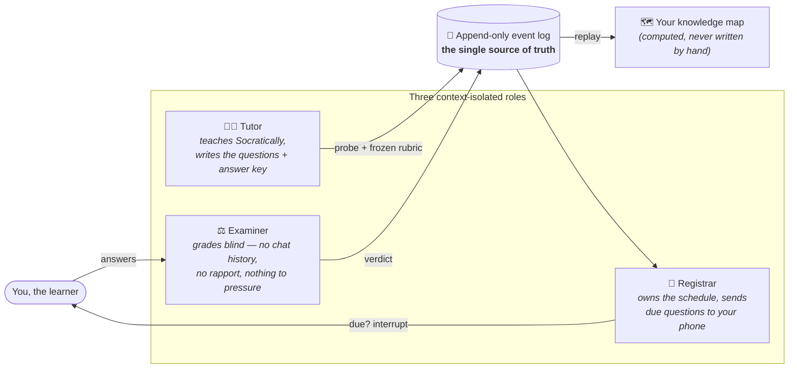

# Anamnesis

> **A learning system that models *you*, not your notes.** It keeps an evidence-backed picture of what you can actually recall — unaided, by what route, and how sure you were while getting it wrong — and asks you questions between sessions so nothing quietly rots.

<p>
  
  
  
  
</p>

*The name means two things at once: Plato's idea of **learning as recollection**, and the clinical word for **a patient's history**. Both fit.*

---

## In one paragraph (no jargon)

Every study tool tracks the *material*. Anki knows when you last saw a flashcard. Obsidian knows what you typed. None of them knows whether you could actually explain the thing right now, from memory, without peeking — or whether the "right" answer you gave last week came from understanding or from a lucky guess. **Anamnesis tracks the one thing that matters: can you produce the answer on your own, and how did you get there?** Everything else — what to revise, where you're overconfident, what's about to fade — is worked out from that record. And because the schedule only helps if it reaches you, it sends you the occasional one-line question out of the blue, so recall keeps happening even when the app is closed.

---

## The problem it's built around

This isn't a hypothetical. It replaces a hand-built setup (a Claude Project + an Obsidian vault + Anki) that produced *real* learning over weeks of solo study — and then failed in ways that turned out to be the whole point:

- **Confidence you can't trust.** Re-reading a page and recalling it cold got stored the same way — or not at all. A confidence map you have to re-verify by hand is worse than no map, because you stop looking at your gaps.
- **No memory of *how* you fail.** A right answer reached by wrong reasoning looked identical to real understanding. The prototype once caught the author's own pattern across sessions: *"in physics a wrong route gives a wrong number and gets caught; in biology it gives a right-sounding sentence and sails through."* No generic tutor notices that.
- **Rules written as prose don't hold.** When the grader kept the whole conversation in view, it yielded to pushback and let confidence get argued upward. When an AI wrote its own progress notes, the notes drifted from reality. Due items rotted for twelve days because "check the schedule" was advice, not a mechanism.

Anamnesis is the answer to those three failures, rebuilt so they **can't** happen — enforced by structure, not by good intentions.

---

## How it works

Three roles handle every question, and they are **deliberately kept from seeing each other's context**. That isolation is the core idea, not an implementation detail.



- **The Tutor** teaches, and when a topic closes it writes the **probes** (specific recall questions) and a **frozen rubric** (the answer key) while your mistakes are still fresh. *Teaching lives outside this repo — see below.*
- **The Examiner** grades one attempt seeing **only** the concept, the question, your exact words, the rubric, and a flag for whether the answer was already on screen. It never sees the conversation — so there's no rapport to protect and no pushback to give in to. **This is the part built today.**
- **The Registrar** reads the record (never the conversation) and decides what's due, then dispatches a one-line question to an ambient channel like Telegram — retrieval out of context, days later, which is the most honest test of memory there is.

**Nothing writes your status directly.** Every action is an *event* appended to a log; your confidence map, schedule, and notes are all **recomputed** from that log. Status has no field to overwrite — so it can't be argued upward, and it can't drift.

### A concept isn't a number

"Properties of Water" isn't `confidence: 3`. It's a rollup of its probes — *explain-back at 0.94, transfer at 0.61*. That gap is exactly the failure a single number hides.

---

## Is this for you?

**Yes, if** you're a self-directed learner working through technical material alone, over months or years, and you want an honest picture of what you actually know rather than what you've merely seen.

**Not really, if** you want a course authored *for* you, passive content to consume, or a classroom/team tool. Anamnesis asks *you* to supply the material and do the recalling — it models the learner, it isn't a content product. v1 has exactly **one** user by design (no accounts, no sync, no onboarding).

---

## For developers

### The shape of it

Anamnesis is a **local-first, single-user MCP service** (Python 3.11+). A teaching conversation *reads* the learner's knowledge state through it; it can never *write* status directly. The design is event-sourced end to end:

- **`core/` is a pure, replayable layer** — no model calls, no network. Given the event log, it deterministically reproduces all derived state. `anamnesis replay --verify` drops the derived tables, replays, and fails loudly on any mismatch.
- **The event log is append-only.** You supersede a fact by appending a new event, never by editing an old one.
- **Grading is blind and instrumented.** The examiner takes an `attempt_id` and nothing else; every grade records the model id, version, and prompt hash.
- **Refusals are first-class successes.** When a caller violates a precondition, the tool returns a structured refusal (`reason_code` + `remedy` + `blocking`) *and* appends a `refused` event — so ordering is enforced by the surface, and every bypass attempt is measurable.

### Planned module map

Dependency direction is hook-enforced — `core/` depends on nothing else in the project, and everything else may depend on it.

```
anamnesis/
  core/          event log, replay, derived state   ← pure, no model/network
  memory/        FSRS-6 spaced-repetition scheduling
  agents/
    examiner/    blind grading                       ← built (Phase 0a)
  candidates/    "what deserves probing next", ranked
  server/        MCP server: tools, preconditions, refusals, the read-back digest
  dispatcher/    always-on: Telegram, scheduling, catch-up, liveness
  export/        Obsidian render, printable paper sheets
  cli/           `anamnesis status`
  teaching/      prose instruction files installed into the external model's config
  tests/
    contract/    frozen — the behavioural contract, must stay green
    fixtures/    the seeded evaluation set
```

### Where teaching lives

**Teaching is *not* in this repo, on purpose.** It stays with an external general-purpose model, driven by the instruction files under `teaching/`. This service only holds and guards the knowledge state. Keeping the two apart is what lets the examiner grade without rapport — the thing the original prototype couldn't do.

### Project status

Early and honest. This is a **spec-first** build: the design was written before the code, and the code is landing phase by phase against a frozen contract.

| Phase | What | State |
|---|---|---|
| **0a** | Blind grading harness + mechanism tests (blindness, three-way output, model-identity recording) | ✅ **done** |
| 0b | κ agreement against a human-labelled set | ⏳ needs the hand-written evaluation set |
| 1 | Event log + replay (`core/`) | 📋 spec'd |
| 2 | Memory & retrieval lanes | 📋 spec'd |
| 3 | MCP tool surface + refusals | 📋 spec'd |
| 4 | Candidates + export | 📋 spec'd |
| 5 | Dispatcher (ambient channel) | 📋 spec'd |
| 6–7 | Paper/photo calibration, trial evaluation | 📋 spec'd |

Phase briefs live in [`prompts/`](prompts/); the full design is in [`spec/design-spec.md`](spec/design-spec.md); what must be tested and why is in [`tests/test-contract.md`](tests/test-contract.md).

### Getting started

```bash
uv sync                          # install (zero runtime deps; examiner extra pulls in anthropic)

pytest tests/contract/phase0/ -v # the contract — should be 7 passed, 3 skipped
pytest tests/ -v                 # everything
ruff check . && mypy .           # lint + types
```

The three skipped tests are the Phase 0b κ gate — they light up once the human-labelled evaluation set exists. The blind-grading harness runs offline; only the real network examiner needs an `ANTHROPIC_API_KEY` (kept in a local `.env`, never committed).

Planned once their phases land: `anamnesis status` (the knowledge digest, human-readable), `anamnesis replay --verify` (drop derived state, replay, diff), and `anamnesis dispatcher run` (the always-on process).

### The invariants (enforced by hooks, not goodwill)

- `core/` makes no model or network calls — it's the pure replayable layer.
- Only the reducer writes derived tables; status has no field to overwrite.
- The event log is append-only; supersede by appending, never editing.
- The examiner never imports the server, dispatcher, cli, or channels.
- The Obsidian vault is an export target, never read back as state.

---

## A note on scope

This is a personal, open-source project built for the joy of it — one learner's tool, in the open. There's no roadmap promise, no support commitment, and (yet) no license. Read the spec, poke at the examiner, borrow the ideas.
